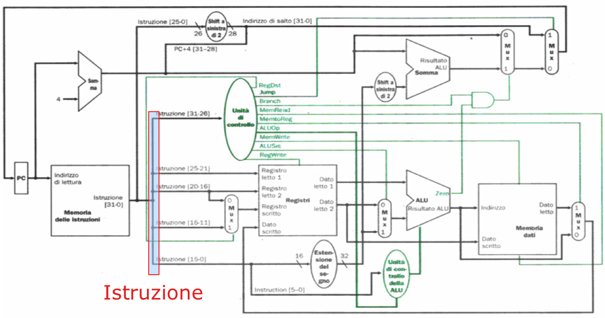

# Architettura degli Elaboratori I 🔌

| Nome corso         |Architettura degli Elaboratori I   |
|--------------------|---|
| Semestre           |Primo   |
| Professore/i       |Borghese Nunzio Alberto, Gabriella Trucco   |
| Crediti            |6   |
| Anno completamento |2024/2025   |
| Valutazione        |22   |

## Descrizione

Il corso introduce le conoscenze relative al funzionamento di un elaboratore digitale: dalle porte logiche, alle operazioni hardware e firmware, per arrivare all'architettura MIPS ed una CPU completa che esegue operazioni in linguaggio macchina

## Struttura materiali

- `Esami`: Contiene le vecchie prove d'esame. Al suo interno sono presenti le cartelle da `2016` a `2025` ciascuna contenente i temi d'esame dell'anno corrispondente, aggiornato a Luglio 2025
- `Laboratorio`: Contiene i materiali relativi al laboratorio del corso, in particolare:
    - `Esami_Laboratorio`: Contiene vecchie prove d'esame di laboratorio
    - `Laboratorio_Architettura_degli_Elaboratori_I`: Contiene le slide del corso di laboratorio. Al suo interno la cartella `Vecchie_Slide` Contiene le slide del corso del 2024
    - `Logisim`: Contiene esercizi vari e circuiti prodotti con Logisim
- `Lezioni`: Contiene le slide delle lezioni di `Borghese` e `Basilico` dell'anno 2024/2025
- `RisposteArchi`: Contiene i file in `md` ed in `pdf` con le risposte di Borghese e con la prova di Luglio 2025 svolta
- `AppuntiArchi1.pdf`: File di appunti vari
- `Archi1.one` e `Archi1.pdf`: Blocco di OneNote contenente esercizi svolti, divisi per sezione, in formato OneNote e PDF
- `Archi_1_Completo.pdf`: Unico file PDF con tutte le slide di Borghese unite
- `Esercizi_algebra_booleana.pdf`: Esercizi vari di algebra booleana

*Francesco Corrado 2025*
