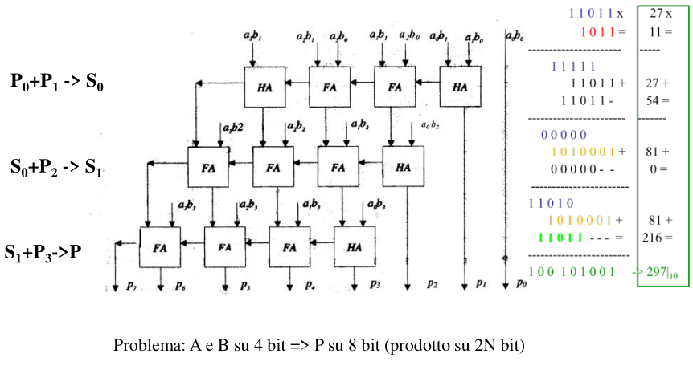
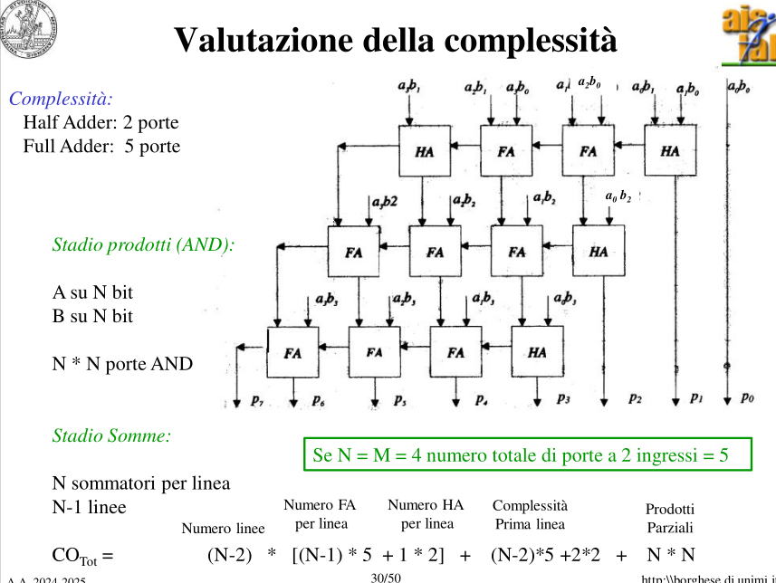
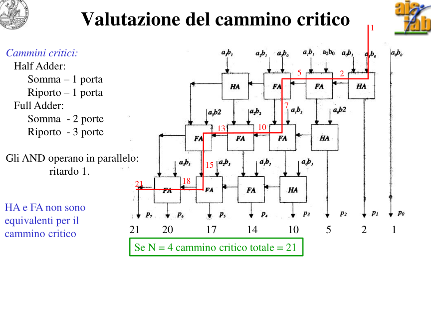
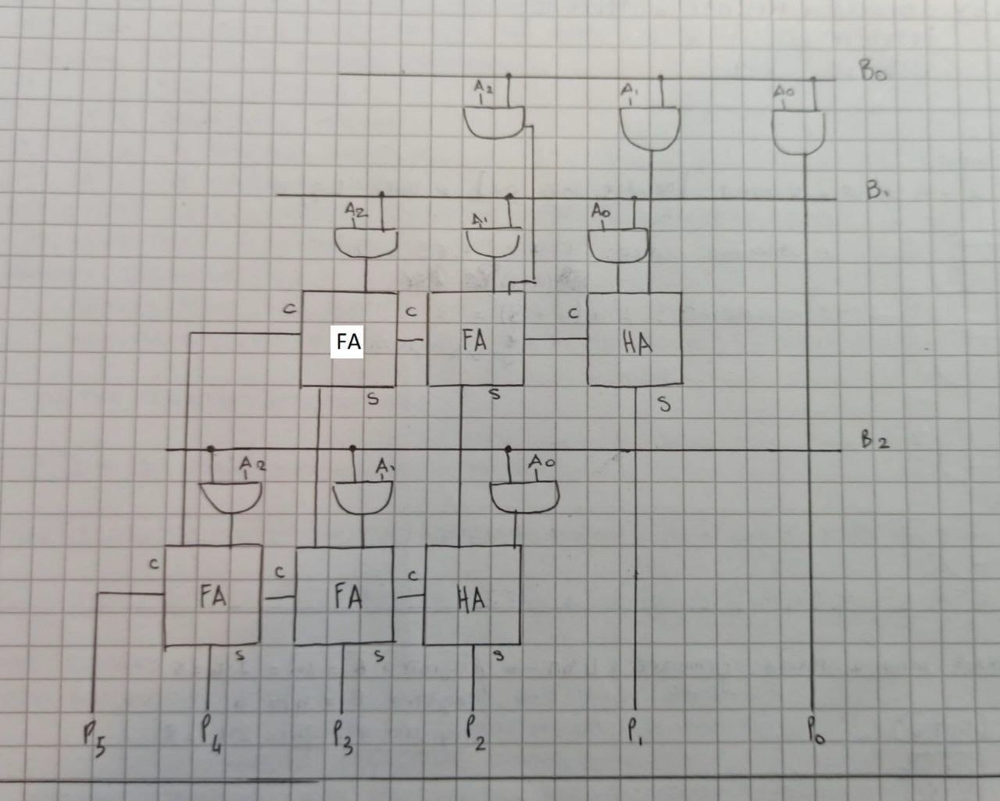
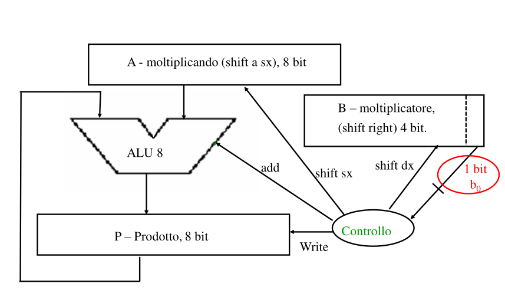
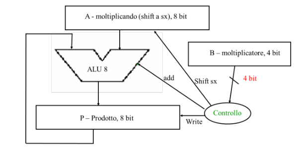
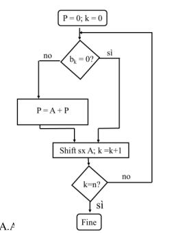
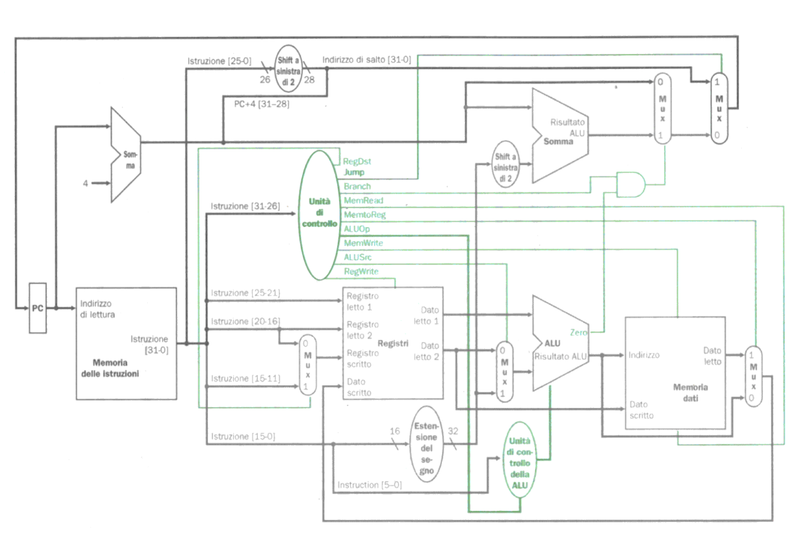

{width=100px height=100px}

**Architettura I: Teoria su domande d'esame**

Il seguente file contiene le domande più comuni tratte dalle prove d'esame del professor Borghese, e cerca di fornire per ciascuna di esse la risposta più appropriata utilizzando le diapositive e appunti del professore come fonte. Le risposte in questo file quindi non sono da intendersi come "ufficiali" o "definitive": sono tentativi di rispondere ai quesiti basandosi sugli appunti. Le risposte degli esercizi cercano di essere generalizzate così da poter fornire una spiegazione qualsiasi siano i dati dell'esercizio.

# Codifica Dati

## Codifica IEEE754, conversioni, limiti

### 1) Convertire in binario il numero decimale XX,XX e codificarlo in IEEE754

1) Si converte il numero e la parte decimale in binario (dividendo per 2)
2) Normalizzare il numero binario
3) Ricavare il bit di segno: + = 0, - = 1
4) Ricavare l'esponente facendo esponente + 127 e convertendolo in binario
5) Il resto delle cifre vanno nella mantissa, aggiugendo zeri fino ad arrivare a 23 bit

Esempio con il numero 16,25

1) 16 in binario = 10000, 0,25 in binario = 0,01. In binario quindi diventa 1000,01
2) Normalizzo 10000,01 facendolo diventare 1,000001×2^4
3) Il numero è positivo: Bit di segno = 0
4) Esponente = 4, quindi 4 + 127 = 131 che in binario diventa 10000011
5) Il resto delle cifre si aggiunge alla mantissa seguiti da 0 fino a 23: 00000100000000000000000

Quindi 16,25 codificato in IEEE754 diventa 0 10000011 00000100000000000000000

### 2) Quale sarà la rappresentazione binaria in IEEE754 del numero decimale ottenuto sommando una unità (1,0) al numero XX,XX? (dell'es precedente)

In questo caso si può semplicemente ricalcolare il valore come nell'esercizio precedente, oppure semplicemente si considera che: aggiungendo una sola unità, il numeero IEEE754 cambierà solo leggermente sulla mantissa

Prendiamo l'esempio precedente: 16,25 che diventa 0 10000011 00000100000000000000000. Se devo calcolare 17,25 in binario, sarà 10001,01 che poi diventerà 1,000101×2^4. Di conseguenza l'esponente e il segno del numero sono identici, l'unica cosa che cambierà di una cifra è la mantissa:

16,25 = 0 10000011 00000100000000000000000  
17,25 = 0 10000011 00010100000000000000000

### 3) Quale sarà la rappresentazione nel Google Brain Format?

Il Google Brain Format è un formato simile all'IEEE754. Mentre l'IEEE754 è formato da 32 Bit (1 segno, 8 esponente, 23 mantissa) il Google Brain Format è invece formato da 16 Bit (1 segno, 8 esponente, 7 mantissa). Per ottenere un numero in questo formato bisogna prima convertire il numero in IEEE754, e successivamente tenere i 16 bit più significativi (1 segno, 8 esponente, i primi 7 della mantissa) per ottenerlo. Utilizzando sempre l'esempio di prima 16,25:

IEEE754: 0 10000011 00000100000000000000000  
Google Brain Format: 0 10000011 0000010

### 4) Quale coppia di numeri codificati sequenzialmente in IEEE754 (variazione del bit meno significativo) dista esattamente una unità?

Nei numeri float32 da differnza si comincia a vedere a partire da 2^24 = 16,777,216, perchè IEEE754 ha 23 cifre per la mantissa. Di conseguenza i numeri

0 10010111 00000000000000000000000 --> 16 777 216  
0 10010111 00000000000000000000001 --> 16 777 217

Sono consecutivi in IEEE754 e distano esattamente una unità

### 5) Qual è la risoluzione della codifica in virgola mobile IEEE754 in singola precisione, della codifica intera e della codifica in virgola fissa?

La risoluzione (ovvero il più piccolo incremento rappresentabile) dei vari formati è:

IEE754: 2 ^ -23 (avendo 23 bit di mantissa)  
Codifica Intera: 1 (puoi distinguere solo tra interi successivi)  
Codifica in Virgola Fissa: 2 ^ -F (dove F è il numero di bit per la parte frazionaria)

### 6) Come viene rappresentata la situazione +oo, -oo e NaN in IEEE754?

In IEEE754 per rappresentare casi speciali come questi si codificano come:

+oo, -oo: Esponente di tutti 1, Mantissa di tutti 0, segno dipendende da se voglio +oo (0) o -oo (1)

+oo --> 0 11111111 00000000000000000000000  
-oo --> 1 11111111 00000000000000000000000

NaN (Not a Number): Esponente di tutti 1, Mantissa con almeno un bit a 1, Segno irrilevante. Quindi ogni numero che ha esponente con tutti 1 e mantissa con almeno un bit diverso da 0 è NaN. Ad esempio:

0 11111111 10000000000000000000000 --> NaN  
1 11111111 01010101010101010101010 --> NaN

### 7) Scrivere in complemento a 2 su X bit la sottrazione espressa da numeri in base 10: Y – Z, calcolarne il risultato ed esprimerlo in codifica binaria in complemento a due.

X è solitamente 8 o 16 bit, Y e Z sono due numeri interi molto bassi

1) Converto i due numeri decimali in binario su X bit (ripentendo il bit di segno per arrivare a X) 
2) Iverto con il complemento a 2 il secondo numero Z per effettuare l'operazione: inverto tutti i bit (0 diventa 1, 1 diventa 0) del numero e sommo 1
3) Sommo Y con -Z e ricavo il risultato dal complemento a due

Esempio: Scrivere in complemento a 2 su 16 bit la sottrazione espressa da numeri in base 10: 12-16 e calcolarne il risultato in binario

1) Converto i numeri: 
12 in binario è 1100, è positivo quindi il bit di segno è 0: aggiungo 0 fino ad arrivare a 16 e ottengo 0000 0000 0000 1100  
16 in binario è 10000, è positivo quindi il bit di segno è 0: aggiungo 0 fino ad arrivare a 16 e ottengo 0000 0000 0001 0000
2) Inverto il secondo numero in complemento a 2:  
Inverto tutti i bit di 16: 0000 0000 0001 0000 diventa 1111 1111 1110 1111. Sommo 1 ed ottengo 1111 1111 1111 0000 ovvero -16 in complemento a 2 su 16 bit  
3) Sommo i valori ed ottengo il risultato:  
Ora posso effettuare la somma binaria tra 0000 0000 0000 1100 e 1111 1111 1111 0000 ovvero 1111 1111 1111 1100. Si tratta di numero negativo in complemento a 2. Per trovare il valore decimale, inverto il numero e sommo 1: ottengo 0000 0000 0000 0100. Il numero quindi è -4, perchè il bit di segno era 1 e 100 in binario è 4. 

# Moltiplicazione/Divisione

## Moltiplicazione Hardware

### Disegnare un moltiplicatore HW su X bit

Esempio: 4 bit

Esempio: 3 bit

Complessità:
t = (N-2) * [(N 1) * 5 + 1 * 2] + (N-2)*5 + 2 *2 + N * N

Complessità per parole su 3 bit = 1 *(2*5+2) + 1*5 + 4 + 9 =  30 porte a due ingressi 

Cammino Critico: 10

## Moltiplicazione Firmware 

### 1) Disegnare il diagramma di flusso di un algoritmo della moltiplicazione binaria intera firmware a 4 bit, e implementarlo in un circuito contenente tre registri: 1 registro moltiplicando (primo fattore) a X bit, 1 registro moltiplicatore (secondo fattore che conterrà il moltiplicatore) a Y bit e 1 registro risultato a Z bit

Caso 1: Moltiplicazione 4 bit con moltiplicando 4 bit, moltiplicatore 8 bit e risultato 8 bit

Caso 2: Moltiplicazione 4 bit con moltiplicando 8 bit, moltiplicatore 8 bit e risultato 8 bit

Caso 3: Moltiplicazione 4 bit con moltiplicando 8 bit, moltiplicatore 4 bit e risultato 8 bit

{width=250px height=650px}

### 2) Cosa contengono i 3 registri all’inizio della moltiplicazione?

A - Moltiplicando  
B - Moltiplicatore  
P - Prodotto

### 3) Evidenziare tutti i cammini relativi al data path, dimensionarli e definire la loro funzione

### 4) Quanti cicli di clock sono necessari per completare l’operazione? Motivare la risposta.

## Divisione Firmware

### 1) Descrivere come si possa modificare il datapath del circuito disegnato per l’esercizio 2, mantenendo i 3 registri specificati, per eseguire anche l’operazione di divisione intera di numeri su 4 bit

Bisogna aggiungere:  
- Segnale shift dx registro A: servira’ a shiftare a destra il divisore.  
- Segnale shift sx registro B: servira’ a shiftare a sinistra il quoziente.  
- Segnale di SUB alla ALU: permette di fare la differenza.  
- Segnale del bit di segno dal registro P alla UC: serve alla UC per verificare il resto e’ negativo. 

### 2) Cosa contengono i 3 registri? Quali segnali di controllo occorre aggiungere? Motivare le modifiche e definire chiaramente la loro funzione

Il registro A conterra’ n bit del divisore e n zeri.  
Il registro B conterra’ n zeri all’inizio e poi conterra’ il quoziente.  
Il registro P conterra’ n zeri e n bit del dividendo. 

### 3) Mostrare come varia il contenuto di tutti e 3 i registri durante i primi 2 passi di esecuzione della divisione X : Y

Esempio di esecuzione di una divisione:

11 : 4

11 in binario = 1011, 00001011
4 in binario = 100, 00000100

Risultato se corretto: 2 resto 3

| Ciclo    | Operazione effettuata                 | Registro B (Quoziente) | Registro A (Divisore) | Registro P (Resto/) | q0 (LSB di P) |
| -------- | ------------------------------------- | ---------- | ---------- | ---------- | ------------- |
| **0**    | Inizializzazione                      | `0000|0000` | `0010|0000` | `0000|1011` | 0             |
| **1**    | resto = resto - div                   | `0000|0000` | `0010|0000` | `1110|1011` | 0             |
|          | reso < 0 = resto + divisore, Shift Sx quoziente, q0 = 0 | `0000|0000` | `0010|0000` | `0000|1011` | 0             |
|          | shift dx divisore                     | `0000|0000` | `0001|0000` | `0000|1011` | 0             |
| **2**    | resto = resto - div                   | `0000|0000` | `0001|0000` | `1111|1011` | 0             |
|          | reso < 0 = resto + divisore, Shift Sx quoziente, q0 = 0 | `0000|0000` | `0001|0000` | `0000|1011` | 0             |
|          | shift dx divisore                     | `0000|0000` | `0000|1000` | `0000|1011` | 0             |
| **3**    | resto = resto - div                   | `0000|0000` | `0000|1000` | `0000|0011` | 0             |
|          | reso > 0 = Shift Sx quoziente, q0 = 1 | `0000|0001` | `0000|1000` | `0000|0011` | 1             |
|          | shift dx divisore                     | `0000|0001` | `0000|0100` | `0000|0011` | 1             |
| **4**    | resto = resto - div                   | `0000|0001` | `0000|0100` | `1111|1111` | 1             |
|          | reso < 0 = resto + divisore, Shift Sx quoziente, q0 = 0 | `0000|0010` | `0000|0100` | `0000|0011` | 0             |
|          | shift dx divisore                     | `0000|0010` | `0000|0010` | `0000|0011` | 0             |

Quoziente: 0000 0010 = 2
Resto: 0000 0011 = 3

# Macchine a Stati Finiti

Progettare una macchina a stati finiti che scorra un testo (leggendo un carattere alla volta) e riconosca nel testo la stringa “XXX” (la coppia di lettere deve necessariamente essere preceduta da uno spazio, ma NON deve essere necessariamente seguita da uno spazio). Progettare la macchina di Huffman associata; calcolarne complessità e cammino critico.

1) Codifico gli stati, input ed output  
2) Disegno il grafo della MSF (STG)  
3) Creo la STT con gli stati prossimi ed output  
4) Ottengo le formule per stati prossimi ed output (posso semplificare con Karnaugh)  
5) Creo i circuiti di Next State ed Output  
6) Creo il circuito MSF  
7) Calcolo la complessità

Esercizio esempio: Progettare una macchina a stati finiti che scorra un testo (leggendo un carattere alla volta) e riconosca nel testo la stringa “AZ” (la coppia di lettere deve necessariamente essere preceduta da uno spazio, ma NON deve essere necessariamente seguita da uno spazio). Progettare la macchina di Huffman associata; calcolarne complessità e cammino critico.

1) Codifico gli stati. Dovendo riconoscere la stringa "AZ", gli stati possibili sono tre: Nulla (se non ho nulla di utile alla stringa), A, AZ. Gli posso codificare come Nulla = 00, A = 01 e AZ = 10. Gli input invece possono essere Nulla (non inserisco niente), A, Z, Altro (inserisco un'altra lettera dell'alfabeto). Allo stesso modo posso codificare gli input. L'output invece può essere solo in due stati: raggiunto (ho la stringa AZ), non raggiunto (tutti gli altri casi). Così facendo ottengo gli stati così codificati:

X = Nulla (00), A (01), AZ (10)  
I = Nulla (00), A (01), Z (10), Altro (11)  
O = Non ho la stringa (0), Ho la stringa (1)

2) 

Disegno il grafo della MSF

3) 

| X1  | X0  | I1  | I0  | X1*  | X0*  | O  |
|---|---|---|---|---|---|---|
| 0  | 0  | 0  | 0  | 0  | 0  | 0  |
| 0  | 0  | 0  | 1  | 0  | 1  | 0  |
| 0  | 0  | 1  | 0  | 0  | 0  | 0  |
| 0  | 0  | 1  | 1  | 0  | 0  | 0  |
| 0  | 1  | 0  | 0  | 0  | 0  | 0  |
| 0  | 1  | 0  | 1  | 0  | 1  | 0  |
| 0  | 1  | 1  | 0  | 1  | 0  | 0  |
| 0  | 1  | 1  | 1  | 0  | 0  | 0  |
| 1  | 0  | 0  | 0  | 1  | 0  | 1  |
| 1  | 0  | 0  | 1  | 0  | 1  | 1  |
| 1  | 0  | 1  | 0  | 0  | 0  | 1  |
| 1  | 0  | 1  | 1  | 0  | 0  | 1  |
| 1  | 1  | 0  | 0  | X  | X  | X  |
| 1  | 1  | 0  | 1  | X  | X  | X  |
| 1  | 1  | 1  | 0  | X  | X  | X  |
| 1  | 1  | 1  | 1  | X  | X  | X  |

N.B: gli stati finali sono X perchè non avendo codificato lo stato 11 non ci importa del suo valore

# Istruzioni MIPS

### 1) Disegnare il ciclo di esecuzione di un’istruzione su un’architettura MIPS a singolo ciclo. Quante fasi si distinguono?

5 fasi:  
- Prelievo (Fetch)  
- Decodifica (Decode)  
- Calcolo (Execute)  
- Lettura/Scrittura (Memory)  
- Write Back

### 2) Quando l’architettura capisce di che istruzione si tratta?

Durante la fase di decode, la Unità di controllo (CU) legge i 6 bit dell' Opcode e capisce di che tipo di istruzione si tratta

### 3) I componenti appartenenti a quali fasi vengono configurati dall’unità di controllo? Perché? Come? 

L'unità di controllo fa parte della fase di Decodifica e configura diversi segnali di controllo per le fasi di Calcolo, Lettura/Scrittura e Write Back

### 4) Cos’è un’ISA? 

Un'ISA (Instruction Set Architecture) definisce l'insieme di istruzioni che un processore può eseguire e fornisce una specifica dettagliata delle operazioni che il processore è in grado di compiere. L'ISA funge da interfaccia tra il software e l'hardware, determinando come il software controlla l'hardware. 

Nota: Borghese mi ha criticato questa risposta all'orale, dicendo che questa è la definizione di IS (Instruction Set) e non di ISA

### 5) Possono due CPU avere la stessa ISA?

Si, due CPU possono avere la stessa ISA. Se due CPU hanno la stessa ISA possono eseguire lo stesso set di istruzioni, quindi il software scritto per una CPU può essere eseguita sull'altra senza modifiche

### 6) Due CPU diverse devono avere una ISA necessariamente diversa? Perché?

No, due CPU non devono avere necessariamente un'ISA diversa. Due CPU possono essere internamente diverse ma implementare la stessa ISA

### 7) Definire i diversi formati delle istruzioni MIPS e specificare la funzione dei diversi campi

Le istruzioni MIPS sono a 32 bit e hanno 3 formati principali:

Formato R (Register):  
- OpCode (6 Bit): codice dell'operazione  
- rs (5 Bit): primo registro sorgente  
- rt (5 Bit): secondo registro sorgente  
- rd (5 Bit): registro destinazione  
- shamt (5 Bit): shift admount (posizioni di shift)  
- funct (6 Bit): Codice selettore ALU (add, sub, and ecc.)  

Formato I (Immediate):  
- OpCode (6 Bit): identifica l'operazione  
- rs (5 Bit): registro sorgente  
- rt (5 Bit): registro destinazione (o sorgente, dipende)  
- immediate (16 Bit): costante immediata o offset

Formato J (Jump):  
- OpCode (6 Bit): identifica l'operazione  
- adress (26 Bit): target del salto

### 8) Descrivere come viene suddivisa in modo logico per convenzione una memoria principale dai processori MIPS e quali sono le ragioni per la scelta dei confini dei diversi segmenti.

{width=300px height=800px}

La memoria (ad esempio 4 GB su indirizzi a 32 bit) viene suddivisa in 3 segmenti logici:

- Text Segment (segmento di testo): Contiene le istruzioni del programma (codice)
- Data Segment (segmento dati): Contiene variabili statiche e globali, si trova dopo il Text Segment. È a sua volta divisa in due parti: dati statici contenente i dati la cui dimensione è conosciuta al momento della compilazione e la cui vita coincide con l'esecuzione del programma, e dati dinamici, ai quali lo spazio è allocato dinamicamente al momento dell'esecuzione
- Stack Segment (segmento Stack): Contiene lo stack allocato dinamicamente da un programma durante l'esecuzione  

Queste diverse aree logiche sono così sviluppate per motivi di separazione logica (separo codice, dati statici e stack), protezione (esecuzione vietata nelle aree dati, scrittura vietata nelle aree di testo) e di convenzioni (semplificano hardware e sistema operativo)

Nota: Borghese all'orale mi ha criticato questa risposta in quanto lui voleva anche le dimensioni delle varie parti e il motivo

# CPU

Esercizio esempio: Specificare il contenuto di tutti i bus della CPU riportata in Figura 1 quando è in esecuzione l’istruzione di beq $1, $2, ind_salto, sapendo che il codice operativo dell’istruzione beq è 4. Si supponga inoltre che l’indirizzo della beq sia 0x4000 0000 e che l’indirizzo di salto sia 0x4000 0040. Evidenziare i bus che trasportano dati utili per l’esecuzione dell’istruzione. Tradurre l’istruzione assembler di beq in linguaggio macchina e rappresentarla in notazione esadecimale. Scrivere in linguaggio macchina l’istruzione di salto incondizionato che consente di saltare allo stesso indirizzo di salto. Il codice operativo dell’istruzione di jump è 2

### 1) Specificare il contenuto di tutti i bus della CPU riportata in Figura 1 quando è in esecuzione l’istruzione di beq $0, $1, ind_beq, sapendo che il codice operativo dell’istruzione beq è 4 e l’indirizzo di salto (ind_beq) è 0x0040 0000. Si supponga inoltre che l’indirizzo della beq sia 0x0400 0000

- **PC (Program Counter):** 0x4000 0000
- **Instruction Bus:** 0x11200010 (istruzione beq codificata, vedi sotto)
- **Register Bus (rs):** $1 (contenuto del registro 1)
- **Register Bus (rt):** $2 (contenuto del registro 2)
- **ALU Bus:** confronto tra $1 e $2 (ALU esegue la sottrazione per verificare uguaglianza)
- **Immediate Bus:** offset = (ind_salto - (PC + 4)) / 4 = (0x4000 0040 - 0x4000 0004) / 4 = 0x3C / 4 = 0xF (15 istruzioni avanti)
- **Branch Target Bus:** (PC + 4) + (offset << 2) = 0x4000 0004 + 0x3C = 0x4000 0040
- **Control Bus:** segnali di controllo per istruzione di branch

**Bus che trasportano dati utili:**
- Instruction Bus
- Register Bus (rs, rt)
- Immediate Bus
- Branch Target Bus

### 2) Tradurre l’istruzione assembler di beq in linguaggio macchina e rappresentarla in notazione esadecimale

Caso BEQ:

L'istruzione da trasformare (beq $1, $2, inc_beq) è un istruzione di formato I. Di conseguenza:

- Opcode: 4, su 6 bit diventa 000100
- Rs: $1, su 5 bit diventa 00001
- Rt: $2, su 5 bit diventa 00010
- Offset: su 16 bit. Per calcolare l'offset devo fare indirizzo di salto - (indirizzo attuale + 4). In questo caso quindi devo fare 0x4000 0040 - (0x4000 0000 + 4). Diventa 0x4000 0040 - 0x4000 0004. Dato che le cifre precedenti sono uguali e quindi si annullano mi concentro su quelle finali: 0x40 - 0x04. Convertendo in binario ottengo 16^1 * 4 - 16^0 * 4 = 64 - 4 = 60. Dato che l'indirizzo non è in byte ma in word, devo dividere per 4 e ottengo 60/4 = 15. Rappresento 15 su 16 bit come 0xF = 0000 0000 0000 1111

Ora devo unire tutti i codici ottenuti, e dividerli a 4 a 4 per convertirli in esadecimale. Ottengo 0001 0000 0010 0010 0000 0000 0000 1111. Converto:  
- 0001 = 0x1  
- 0000 = 0x0  
- 0010 = 0x2  
- 0010 = 0x2  
- 0000 = 0x0  
- 0000 = 0x0  
- 0000 = 0x0  
- 1111 = 0xF

Numero finale ottenuto: 0x1022000F

Caso LW (e anche SW):

lw $0, 32 ($1) sapendo che il codice operativo dell’istruzione lw è 35

- Opcode: 35, su 6 bit diventa 100011  
- Rs: $1, su 5 bit diventa 00001  
- Rt: $0, su 5 bit diventa 00000  
- Offset: 32 = 0000000000100000 

1000 1100 0010 0000 0000 0000 0010 0000

Numero finale ottenuto: 0x8C200020

### 3) Scrivere in linguaggio macchina l’istruzione di salto incondizionato che consente di saltare allo stesso indirizzo di salto. Il codice operativo dell’istruzione di jump è 2

0x4000 0000 beq

0x4000 0040 salto

Istruzione jump formata da 

- Opcode: su 6 bit 000010
- Indirizzo: Indirizzo Salto/4 = 0x4000 0040 = 0x1000 0010 = 0001 0000 0000 0000 0000 0000 0001 0000. Prendo i 26 meno significativi ovvero 00 0000 0000 0000 0000 0001 0000

L'istruzione finale è Opcode + 26 LSB di indirizzo = 0000 1000 0000 0000 0000 0000 0001 0000

Numero finale ottenuto: 0x08000010

# Algebra Relazionale

### 1) Scrivere una funzione logica a piacere, di 3 variabili in ingresso e 2 in uscita, il cui circuito associato abbia cammino critico pari a 3 e complessità pari a 5

Crea un circuito che abbia numero di porte pari alla complessità e max numero di porte in filr pari al cammino critico

### 2) Trasformare la funzione logica scritta per l’esercizio precedente nella prima e nella seconda forma canonica.

Ricava la tabella di verità, ottieni midtermini e calcola SOP e POS

SOP = tutte le uscite con 1  
POS = tutte le uscite con 0

### 3) Mediante manipolazione algebrica, facendo riferimento alle forme canoniche scritte per l’esercizio precedente, trasformare la prima forma canonica nella seconda o viceversa.

Utilizza DeMorgan principalmente ma anche varie formule di manipolazione algebrica per ottenere il risultato

