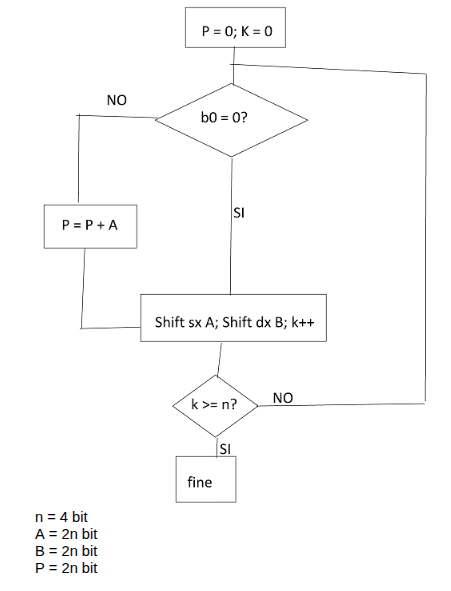
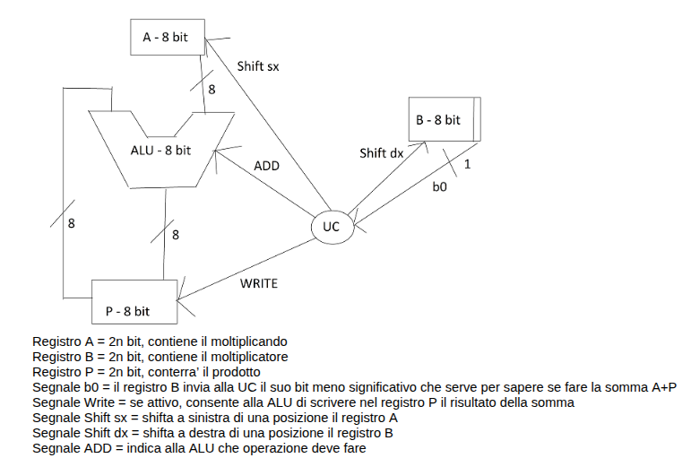
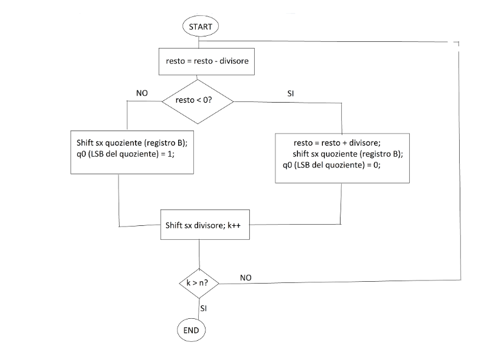
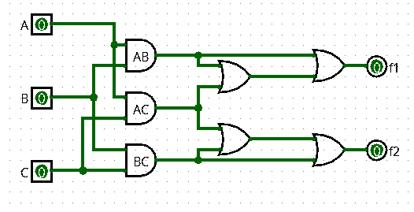
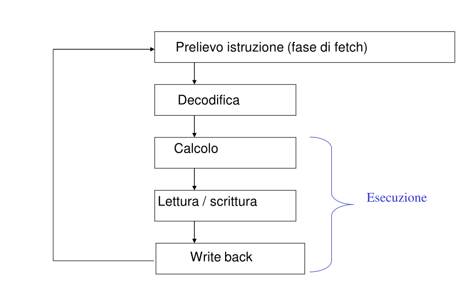
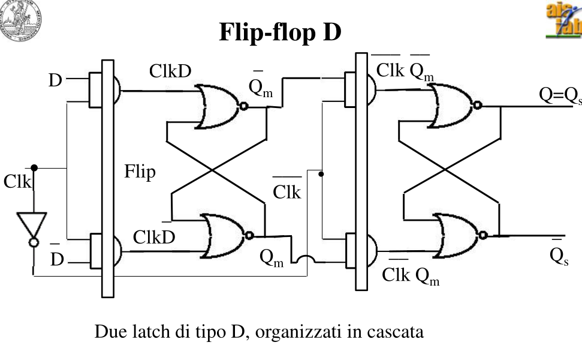
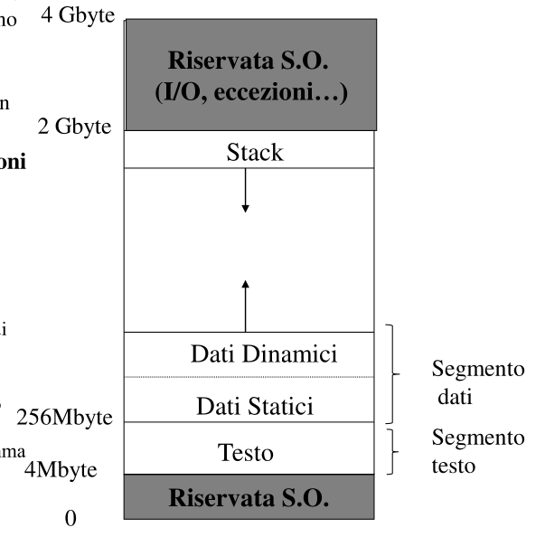
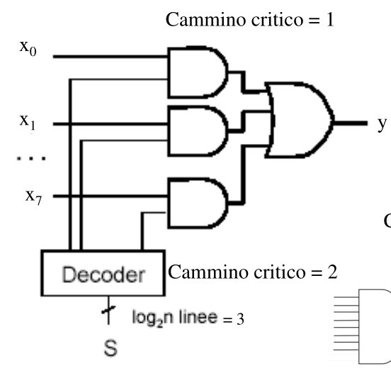

# Esame Archi 1 - 22 Settembre 2025

1. [4] Convertire in decimale il numero binario, codificato secondo la codifica IEEE754: 1 10000001 10000000000000000000000. Quale sarà il numero successivo a 8.388.608 (2^23) in IEEE754. Quale sarà la rappresentazione binaria del numero decimale ottenuto nel Google Brain Format? Qual è la risoluzione della codifica in virgola mobile IEEE 754, della codifica intera e della codifica in virgola fissa? Come viene rappresentata la situazione +oo, -oo e NaN in IEEE754? Scrivere in complemento a 2 su 16 bit la sottrazione espressa da numeri in base 10: 6 - 13 e calcolarne il risultato in binario.

2. [3] Disegnare il diagramma di flusso di un algoritmo della moltiplicazione binaria intera firmware a 4 bit, e implementarlo in un circuito contenente tre registri: 1 registro moltiplicando a 8 bit, 1 registro moltiplicatore a 8 bit e 1 registro risultato a 8 bit. Evidenziare tutti i cammini relativi al data path, dimensionarli e definire la loro funzione.

3. [4] Descrivere come si possa modificare il datapath del circuito disegnato per l’esercizio 2, mantenendo i 3 registri specificati, per eseguire anche l’operazione di divisione intera di numeri su 4 bit. Quali segnali di controllo occorre aggiungere? Motivare le modifiche e definire chiaramente la loro funzione. Mostrare come varia il contenuto di tutti e 3 i registri durante i primi 2 passi di esecuzione della divisione 11 : 4.

4. [2] Scrivere una funzione logica a piacere, di 3 variabili in ingresso e 2 in uscita, il cui circuito associato abbia cammino critico pari a 3 e complessità pari a 7.

5. [2] Trasformare la funzione logica scritta per l’esercizio precedente nella prima e nella seconda forma canonica.

6. [2] Mediante manipolazione algebrica, facendo riferimento alle forme canoniche scritte per l’esercizio precedente, trasformare la prima forma canonica nella seconda o viceversa.

7. [4] Specificare il contenuto di tutti i bus della CPU riportata in Figura 1 quando è in esecuzione l’istruzione di lw $0, 32($1), sapendo che il codice operativo dell’istruzione lw è (32 o 35?). Evidenziare i bus che trasportano dati utili per l’esecuzione dell’istruzione. Tradurre l’istruzione assembler in linguaggio macchina e rappresentarla in notazione esadecimale.

8. [2] Disegnare il ciclo di esecuzione di un’istruzione su un’architettura MIPS a singolo ciclo. Quante fasi si distinguono? Quando l’architettura capisce di che istruzione si tratta? I componenti appartenenti a quali fasi vengono configurati dall’unità di controllo? Perché? Cos’è un’ISA? Possono due CPU avere la stessa ISA? Due CPU diverse devono avere una ISA necessariamente diversa? Perché?

9. [3] Progettare un flip flop che funzioni sia come elemento di memoria sia come shift register

10. [2] Definire i diversi formati delle istruzioni MIPS e specificare la funzione dei diversi campi. Descrivere come viene suddivisa in modo logico per convenzione una memoria principale dai processori MIPS e quali sono le ragioni per la scelta dei confini dei diversi segmenti.

11. [3] Costruire con porte logiche un multiplexer a 4 ingressi. Definire complessità e cammino critico e motivare la risposta.

12. [6] Progettare una macchina a stati finiti che scorra un testo (leggendo un carattere alla volta) e riconosca nel testo la stringa “AAA“ (la tripletta di lettere NON deve necessariamente essere preceduta o seguita da spazi). Progettare la macchina di Huffman associata; calcolarne comlplessità e cammino critico.

SOLUZIONI

1. [4] Convertire in decimale il numero binario, codificato secondo la codifica IEEE754: 1 10000001 10000000000000000000000. Quale sarà il numero successivo a 8.388.608 (2^23) in IEEE754. Quale sarà la rappresentazione binaria del numero decimale ottenuto nel Google Brain Format? Qual è la risoluzione della codifica in virgola mobile IEEE 754, della codifica intera e della codifica in virgola fissa? Come viene rappresentata la situazione +oo, -oo e NaN in IEEE754? Scrivere in complemento a 2 su 16 bit la sottrazione espressa da numeri in base 10: 6 - 13 e calcolarne il risultato in binario.

1 10000001 10000000000000000000000

1 = Numero negativo
10000001 = 129. Esponente = 129 - 127 = 2

Quindi il numero è: -1,1 x 2^2

In decimale diventa: -110 = -6

Il numero successivo a 2^23 in IEE754 sarà 2?23 + 1 perchè non ho più sensitibilità nei Bit

6 su 16 bit: 0000 0000 0000 0110
13 su 16 bit: 0000 0000 0000 1101

-13 in complemento a 2 diventa: 1111 1111 1111 0010 + 1 = 1111 1111 1111 0011

Somma:
0000 0000 0000 0110 +
1111 1111 1111 0011 =
1111 1111 1111 1001

Che se ritrasformato, diventa un numero negativo (perchè bit negativi), 0000 0000 0000 0110 + 1 = 111 = -7

2. [3] Disegnare il diagramma di flusso di un algoritmo della moltiplicazione binaria intera firmware a 4 bit, e implementarlo in un circuito contenente tre registri: 1 registro moltiplicando a 8 bit, 1 registro moltiplicatore a 8 bit e 1 registro risultato a 8 bit. Evidenziare tutti i cammini relativi al data path, dimensionarli e definire la loro funzione.

{width=250px height=650px}

Spiegazione esecuzione:

11 (1011) x 5 (0101) = 55 (00110111)

| Ciclo    | Registro A | Registro B | b0 (LSB di B) | Registro P | Operazioni fatte                      |
| -------- | ---------- | ---------- | ------------- | ---------- | ------------------------------------- |
| **Init** | `00001011` | `00000101` | 1             | `00000000` | Inizializzazione                      |
| **1**    | `00001011` | `00000101` | 1             | `00001011` | P = P + A → Write; A ← A<<1; B ← B>>1 |
| **2**    | `00010110` | `00000010` | 0             | `00001011` | Nessuna somma; A ← A<<1; B ← B>>1     |
| **3**    | `00101100` | `00000001` | 1             | `00110111` | P = P + A → Write; A ← A<<1; B ← B>>1 |
| **4**    | `01011000` | `00000000` | 0             | `00110111` | Nessuna somma; A ← A<<1; B ← B>>1     |

3. [4] Descrivere come si possa modificare il datapath del circuito disegnato per l’esercizio 2, mantenendo i 3 registri specificati, per eseguire anche l’operazione di divisione intera di numeri su 4 bit. Quali segnali di controllo occorre aggiungere? Motivare le modifiche e definire chiaramente la loro funzione. Mostrare come varia il contenuto di tutti e 3 i registri durante i primi 2 passi di esecuzione della divisione 11 : 4.

Bisogna aggiungere:  
- Segnale shift dx registro A: servira’ a shiftare a destra il divisore.  
- Segnale shift sx registro B: servira’ a shiftare a sinistra il quoziente.  
- Segnale di SUB alla ALU: permette di fare la differenza.  
- Segnale del bit di segno dal registro P alla UC: serve alla UC per verificare il resto e’ negativo. 

Il registro A conterra’ n bit del divisore e n zeri.  
Il registro B conterra’ n zeri all’inizio e poi conterra’ il quoziente.  
Il registro P conterra’ n zeri e n bit del dividendo. 

Step, ad ogni ciclo
- Resto = resto - divisore
- Se resto < 0 = 
    - resto = resto + divisore
    - shift sx quoziente (B)
    - q0 (LSB di quoziente) = 0
- Se resto > 0 =
    - shift sx quoziente (B)
    - q0 (LSB di quoziente) = 1
- Shift sx divisore, k = k+1

Se k > 4
- Fine

11 : 4

11 in binario = 1011, 00001011
4 in binario = 100, 00000100

Risultato se corretto: 2 resto 3

| Ciclo    | Operazione effettuata                 | Registro B (Quoziente) | Registro A (Divisore) | Registro P (Resto/) | q0 (LSB di P) |
| -------- | ------------------------------------- | ---------- | ---------- | ---------- | ------------- |
| **0**    | Inizializzazione                      | `0000|0000` | `0010|0000` | `0000|1011` | 0             |
| **1**    | resto = resto - div                   | `0000|0000` | `0010|0000` | `1110|1011` | 0             |
|          | reso < 0 = resto + divisore, Shift Sx quoziente, q0 = 0 | `0000|0000` | `0010|0000` | `0000|1011` | 0             |
|          | shift dx divisore                     | `0000|0000` | `0001|0000` | `0000|1011` | 0             |
| **2**    | resto = resto - div                   | `0000|0000` | `0001|0000` | `1111|1011` | 0             |
|          | reso < 0 = resto + divisore, Shift Sx quoziente, q0 = 0 | `0000|0000` | `0001|0000` | `0000|1011` | 0             |
|          | shift dx divisore                     | `0000|0000` | `0000|1000` | `0000|1011` | 0             |
| **3**    | resto = resto - div                   | `0000|0000` | `0000|1000` | `0000|0011` | 0             |
|          | reso > 0 = Shift Sx quoziente, q0 = 1 | `0000|0001` | `0000|1000` | `0000|0011` | 1             |
|          | shift dx divisore                     | `0000|0001` | `0000|0100` | `0000|0011` | 1             |
| **4**    | resto = resto - div                   | `0000|0001` | `0000|0100` | `1111|1111` | 1             |
|          | reso < 0 = resto + divisore, Shift Sx quoziente, q0 = 0 | `0000|0010` | `0000|0100` | `0000|0011` | 0             |
|          | shift dx divisore                     | `0000|0010` | `0000|0010` | `0000|0011` | 0             |

Quoziente: 0000 0010 = 2
Resto: 0000 0011 = 3

4. [2] Scrivere una funzione logica a piacere, di 3 variabili in ingresso e 2 in uscita, il cui circuito associato abbia cammino critico pari a 3 e complessità pari a 7.

F1 = (AB + AC) + AB
F2 = (BC + AC) + BC

5. [2] Trasformare la funzione logica scritta per l’esercizio precedente nella prima e nella seconda forma canonica.

F1  
SOP: A!BC + AB!C + ABC  
POS: (A + B + C) + (A + B + !C) + (A + !B + C) + (A + !B + !C) + (!A + B + C)

F2  
SOP: !ABC + A!BC + ABC  
POS: (A + B + C) + (A + B + !C) + (A + !B + C) + (!A + B + C) + (!A + !B + C)

6. [2] Mediante manipolazione algebrica, facendo riferimento alle forme canoniche scritte per l’esercizio precedente, trasformare la prima forma canonica nella seconda o viceversa.

DE MORGAN:

!(AB) = !A + !B  
!(A + B) = !A!B

Da SOP a POS:

- A!BC + AB!C + ABC, fattorizzo in A(!BC + B!C + BC)  
- so che BC + B!C = B (C + !C) = B x 1 = B, quindi A(!BC + B)  
- so che B + !BC = (B + !B)(B + C)= 1 x (B + C)= B + C, quindi  
- A(B + C) = forma iniziale  
- A(!A + B + C) = A!A + AB + AC = 0 + AB + AC = A(B+C), quindi A (!A + B + C)  
- so che A = (A + B)(A + !B), quindi (A + B)(A + !B)(!A + B + C)  
- Allo stesso modo: A + B = (A + B + C)(A + B + !C)  
A + !B = (A + !B + C)(A + !B + !C)  
- Sostituisco:  (A + B + C)(A + B + !C)(A + !B + C)(A + !B + !C)(!A + B + C)  

7. [4] Specificare il contenuto di tutti i bus della CPU riportata in Figura 1 quando è in esecuzione l’istruzione di lw $0, 32($1), sapendo che il codice operativo dell’istruzione lw è 35. Evidenziare i bus che trasportano dati utili per l’esecuzione dell’istruzione. Tradurre l’istruzione assembler in linguaggio macchina e rappresentarla in notazione esadecimale.

lw $0, 32 ($1) sapendo che il codice operativo dell’istruzione lw è 35

- Opcode: 35, su 6 bit diventa 100011  
- Rs: $1, su 5 bit diventa 00001  
- Rt: $0, su 5 bit diventa 00000  
- Offset: 32 = 0000000000100000 

1000 1100 0010 0000 0000 0000 0010 0000

Numero finale ottenuto: 0x8C200020

8. [2] Disegnare il ciclo di esecuzione di un’istruzione su un’architettura MIPS a singolo ciclo. Quante fasi si distinguono? Quando l’architettura capisce di che istruzione si tratta? I componenti appartenenti a quali fasi vengono configurati dall’unità di controllo? Perché? Cos’è un’ISA? Possono due CPU avere la stessa ISA? Due CPU diverse devono avere una ISA necessariamente diversa? Perché?

5 fasi:  
- Prelievo (Fetch)  
- Decodifica (Decode)  
- Calcolo (Execute)  
- Lettura/Scrittura (Memory)  
- Write Back

Durante la fase di decode, la Unità di controllo (CU) legge i 6 bit dell' Opcode e capisce di che tipo di istruzione si tratta

L'unità di controllo fa parte della fase di Decodifica e configura diversi segnali di controllo per le fasi di Calcolo, Lettura/Scrittura e Write Back

Un'ISA (Instruction Set Architecture) definisce l'insieme di istruzioni che un processore può eseguire e fornisce una specifica dettagliata delle operazioni che il processore è in grado di compiere. L'ISA funge da interfaccia tra il software e l'hardware, determinando come il software controlla l'hardware. 

Nota: Borghese mi ha criticato questa risposta all'orale, dicendo che questa è la definizione di IS (Instruction Set) e non di ISA

Si, due CPU possono avere la stessa ISA. Se due CPU hanno la stessa ISA possono eseguire lo stesso set di istruzioni, quindi il software scritto per una CPU può essere eseguita sull'altra senza modifiche

No, due CPU non devono avere necessariamente un'ISA diversa. Due CPU possono essere internamente diverse ma implementare la stessa ISA

9. [3] Progettare un flip flop che funzioni sia come elemento di memoria sia come shift register

10. [2] Definire i diversi formati delle istruzioni MIPS e specificare la funzione dei diversi campi. Descrivere come viene suddivisa in modo logico per convenzione una memoria principale dai processori MIPS e quali sono le ragioni per la scelta dei confini dei diversi segmenti.

Le istruzioni MIPS sono a 32 bit e hanno 3 formati principali:

Formato R (Register):  
- OpCode (6 Bit): codice dell'operazione  
- rs (5 Bit): primo registro sorgente  
- rt (5 Bit): secondo registro sorgente  
- rd (5 Bit): registro destinazione  
- shamt (5 Bit): shift admount (posizioni di shift)  
- funct (6 Bit): Codice selettore ALU (add, sub, and ecc.)  

Formato I (Immediate):  
- OpCode (6 Bit): identifica l'operazione  
- rs (5 Bit): registro sorgente  
- rt (5 Bit): registro destinazione (o sorgente, dipende)  
- immediate (16 Bit): costante immediata o offset

Formato J (Jump):  
- OpCode (6 Bit): identifica l'operazione  
- adress (26 Bit): target del salto

{width=300px height=800px}

La memoria (ad esempio 4 GB su indirizzi a 32 bit) viene suddivisa in 3 segmenti logici:

- Text Segment (segmento di testo): Contiene le istruzioni del programma (codice)
- Data Segment (segmento dati): Contiene variabili statiche e globali, si trova dopo il Text Segment. È a sua volta divisa in due parti: dati statici contenente i dati la cui dimensione è conosciuta al momento della compilazione e la cui vita coincide con l'esecuzione del programma, e dati dinamici, ai quali lo spazio è allocato dinamicamente al momento dell'esecuzione
- Stack Segment (segmento Stack): Contiene lo stack allocato dinamicamente da un programma durante l'esecuzione  

Queste diverse aree logiche sono così sviluppate per motivi di separazione logica (separo codice, dati statici e stack), protezione (esecuzione vietata nelle aree dati, scrittura vietata nelle aree di testo) e di convenzioni (semplificano hardware e sistema operativo)

Nota: Borghese all'orale mi ha criticato questa risposta in quanto lui voleva anche le dimensioni delle varie parti e il motivo

11. [3] Costruire con porte logiche un multiplexer a 4 ingressi. Definire complessità e cammino critico e motivare la risposta.

MIA SOLUZIONE (e di tizio):

CO = 8 AND e 1 OR = 9   
CC = AND + AND + OR = 3 

CHAT GPT:

Complessità:

Decoder: 4 AND = 4  
MUX: 4 AND, 1 OR (che però ha 4 ingressi e va considerato come 3): 7

TOT: 11

Cammino Critico:

Decoder:  NOT + AND = 2
MUX: AND + OR = 2

TOT: 4

12. [6] Progettare una macchina a stati finiti che scorra un testo (leggendo un carattere alla volta) e riconosca nel testo la stringa “AAA“ (la tripletta di lettere NON deve necessariamente essere preceduta o seguita da spazi). Progettare la macchina di Huffman associata; calcolarne comlplessità e cammino critico.

X: Nulla, A, AA, AAA (00, 01, 10, 11)  
I: Nulla, A, Altro (00, 01, 10)  
Y: 0, 1
X0: Nulla